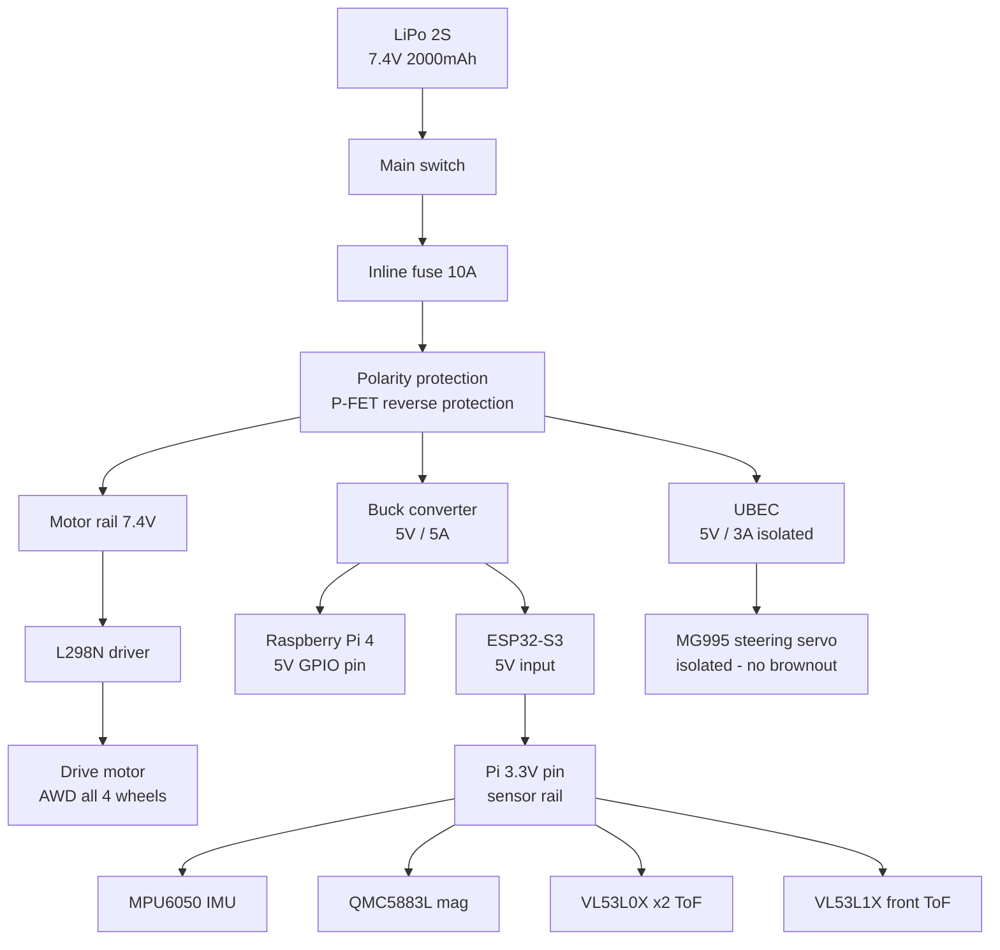
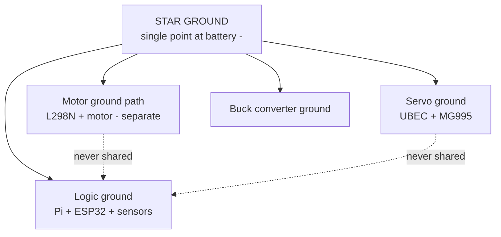

<!--
=============================================================================
WRO 2026 — 4WS AWD Autonomous Robot
File: docs/power/POWER_DISTRIBUTION.md
Rev:  v9.9  |  Status: RELEASED
=============================================================================
-->

# Power Distribution — How the Robot Is Powered

This document explains how electrical power flows through the WRO 2026
robot: where it comes from, how it is split into rails, why each rail
exists, and how to verify it on the bench.

Design goal: **no brownout, no interference, no shutdown surprises**
— learned the hard way across 90 development versions.

---

## 1. Design rules (learned from real failures)

| # | Rule | Why (history evidence) |
|---|------|------------------------|
| 1 | **Motors never share a rail with logic** | Motor start drew the battery down until the ESP32 brownout-reset loop (v2.x, 4 days) |
| 2 | **The servo gets its own isolated 5V rail** | MG995 stall current (>1A) sags shared 5V rails and resets the Pi/ESP32 |
| 3 | **Bulk capacitance on every rail** | A 1000µF cap on the motor rail fixed the brownout reboot loop |
| 4 | **Star ground, one common point** | Motor current through a shared ground wire corrupted the I2C IMU bus (v5.x) |
| 5 | **Protection before anything else** | Fuse + switch + polarity protection cost cents and prevent a dead race day |
| 6 | **Low-voltage cutoff before deep discharge** | LiPo below 3.3V/cell is permanently damaged |

---

## 2. Power tree



Three independent rails, one battery:

| Rail | Voltage | Source | Feeds | Why separate |
|------|---------|--------|-------|--------------|
| **Motor rail** | 7.4V (battery direct) | LiPo → L298N `VS` | L298N → drive motor | High current, huge transients — must never touch logic |
| **Logic 5V rail** | 5V / 5A | Buck converter | Pi 4, ESP32-S3 | Clean, regulated, stable under load |
| **Servo rail** | 5V / 3A | Isolated UBEC | MG995 steering servo | Servo stall current sags shared rails |
| **Sensor rail** | 3.3V | Pi 3.3V pin | All I2C sensors | Small current (<60mA), close to the Pi bus |

---

## 3. Power budget

Measured/typical values, not datasheet maximums:

| Consumer | Voltage | Avg current | Peak current | Avg power |
|----------|---------|-------------|--------------|-----------|
| Drive motor (single, AWD) | 7.4V | 0.9A | 2.5A stall | 6.7W |
| L298N driver loss | 7.4V | 0.2A | — | 1.5W |
| MG995 steering servo | 5V | 0.35A | 1.5A stall | 1.8W |
| Raspberry Pi 4 (headless + camera) | 5V | 1.3A | 2.0A | 6.5W |
| ESP32-S3 (UART + PWM only) | 5V | 0.30A | 0.5A | 1.5W |
| Sensors (IMU + mag + 3×ToF) | 3.3V | 0.06A | 0.09A | 0.2W |
| **Total** | — | **~3.1A @7.4V equiv** | **~5.6A** | **~18.2W** |

Battery runtime estimate:

```text
Battery energy = 7.4V × 2.0Ah = 14.8 Wh
Runtime        = 14.8 Wh ÷ 18.2 W ≈ 49 min (ideal)
With 20% margin and degradation → 35–40 min safe runtime
```

A WRO round is 3 minutes — the battery is 10× over-provisioned, which is
exactly the margin we want on race day.

---

## 4. Protection chain


| Part | Value | Purpose |
|------|-------|---------|
| Main switch | SPDT, 10A | Kill everything in one move |
| Fuse | 10A slow-blow, inline | Dead short = fuse, not fire |
| Polarity protection | P-FET (or Schottky 10A) | Reversed battery = no damage |
| Low-voltage cutoff | 6.6V threshold | Protects the LiPo, buzzer warns |
| Bulk cap motor rail | 1000µF electrolytic | Absorbs the start transient (documented v2.x fix) |
| Bulk cap 5V rail | 470µF electrolytic | Holds the Pi through peaks |
| Servo rail cap | 100µF + 0.1µF | Stall-current spikes |

---

## 5. Grounding scheme

The single most important wiring decision. One common ground point;
every rail returns there on its own wire.



Rules:

- **Never daisy-chain grounds** — motor current through a logic ground
  wire raised the ground potential and corrupted I2C reads (v5.x).
- I2C data wires are **twisted with their own ground return**.
- Motor power wires are **shortest path, away from the I2C and servo
  signal wires** — electromagnetic interference scales with loop area.
- All grounds meet at exactly one star point.

---

## 6. Wire gauge

| Run | Gauge | Reason |
|-----|-------|--------|
| Battery → switch → fuse | 18 AWG | Short, carries everything |
| Fuse → L298N (motor rail) | 18 AWG | Motor transients |
| L298N → motor | 20 AWG | Up to 2.5A stall |
| Buck → Pi 4 | 20 AWG | Pi can draw 2A |
| UBEC → servo | 22 AWG | Stall current |
| I2C / UART / signal | 26–28 AWG twisted | Noise immunity |

---

## 7. Why this design — the evidence

| Failure we actually had | What it taught us | Where fixed |
|------------------------|-------------------|-------------|
| ESP32 brownout reboot loop at motor start (v2.x, 4 days) | Motor rail must be separate + bulk capacitance | Sections 2, 4 |
| Mag heading destroyed when motors ran (v5.x) | Current wires and sensor wires must be separated + twisted | Section 5 |
| Servo glitches under load on the shared 5V | Servo needs its own isolated supply | Section 2 |
| Camera/ESP32 reset during hard steering | Stall current on a shared rail | Section 2 |
| LiPo voltage drop on race morning | Low-voltage cutoff + buzzer | Section 4 |

---

## 8. Build & verify checklist

Bench test before every competition day (10 minutes):

1. **Switch off** — no voltage anywhere after the switch. Fuse installed.
2. **Switch on, no motor** — 7.4V at battery, 5.0V at Pi and ESP32,
   5.0V at UBEC, 3.3V at the sensor rail. Measured with a multimeter.
3. **Servo sweep test** — servo moves, Pi stays alive, voltage at Pi
   never drops below 4.8V.
4. **Motor ramp test** — motor starts, ESP32 stays in RUN state
   (no brownout reset, no watchdog reboot).
5. **Full system 3-minute run** — voltage at battery end ≥ 6.8V,
   no resets, no I2C errors in the log.
6. **Weight check** — battery + wiring included in the 1.5 kg limit
   (Rule 11.2).

## 9. WRO rule compliance

| Rule | Requirement | Our power solution |
|------|-------------|--------------------|
| 11.2 | Weight ≤ 1.5 kg | 2S 2000mAh LiPo (~100g), slim wiring |
| 11.6 / 11.10 | Wireless off during rounds | Switch disconnects everything; radios disabled in code |
| 11.13 | Max 2 driving motors, mechanically linked | 1 motor, 4 wheels, AWD linkage |
| Power & Sense (Appendix C, 4 pts) | Battery isolation + wiring diagram | This document + `docs/wiring/WIRING.md` |
